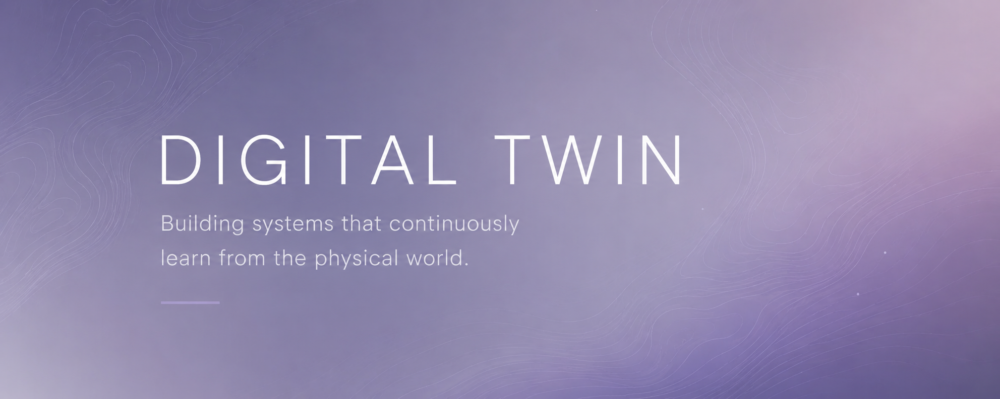

<p align="center">
  
</p>
# Digital Twin

> **Building systems that continuously learn from the physical world.**

Open lectures, code, and practical tools for understanding the next generation of Digital Twins.


---

## Welcome
Welcome to the official repository accompanying the **Digital Twin Lecture Series**.
This repository contains:

- 📖 Lecture slides
- 💻 Jupyter notebooks
- ⚙️ Python implementations
- 📚 Companion guidebook
- 🔬 Research case studies
- 🚀 Future updates

The goal is to explore how physics and AI can work together to build trustworthy intelligent systems.
---

## Course Structure
| Lecture | Topic | Status |
|---------|-------|--------|
| 01 | What is a Digital Twin? | ✅ |
| 02 | Modeling Complex Systems | ✅ |
| 03 | Physics-Informed Machine Learning | ✅ |
| 04 | More Coming Soon | 🚧 |

## Getting Started
Clone the repository

```bash
git clone https://github.com/WendiGuo888/Digital-Twin-Course.git
```

Install the required packages

```bash
pip install -r requirements.txt
```

Open the notebook

```bash
jupyter notebook
```
A companion guidebook is included to help you understand the concepts beyond the implementation.

It focuses on:

- Digital Twin fundamentals
- Physics-informed learning
- Battery modeling
---

## Further Exploration
Instead of reproducing the results,
try to improve them.
Build something new.

## License
MIT License
---

> **Models help us understand reality.**
> 
> **Digital Twins help us improve it.**
